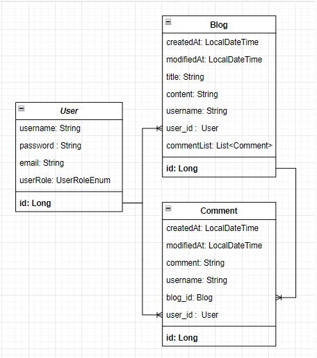

# SpringAssignment-Lv2 & Lv3

# Spring Lv.2 & Lv. 3

<aside>
🏁 **Goal:  "회원가입, 로그인 기능이 추가된 나만의 항해 블로그 백엔드 서버 만들기"**

</aside>

[PostMan JWT 활용 방법 확인하기](https://www.notion.so/PostMan-JWT-4a978c50b1f74b36a733509d95536365?pvs=21)

- [과제 시작 전 읽어보기](https://www.notion.so/Spring-Lv-2-ea5651cd95254cafb2ac922129a213ec?pvs=21)

<aside>
🚩 **Requirement:  과제에 요구되는 사항이에요**

</aside>

⚠️ **아래의 요구사항에 맞게 API 명세서를 수정해 보고 프로젝트를 수정 및 기능을 추가해 보세요!**
※ PostMan 사용 링크: https://www.notion.so/Spring-Lv-2-3-b7ddcfd668d242248dce76cd75ba9db8?pvs=4#e9a825070f2b4e8b8daa12c408138de2
※ ERD 이미지: 
※ API 명세서 링크 : https://www.notion.so/Spring-Lv-2-3-b7ddcfd668d242248dce76cd75ba9db8?pvs=4#f8c04cf4713340f8a3fcca5808d4ab2f

1. 회원 가입 API
    - username, password를 Client에서 전달받기
    - username은  `최소 4자 이상, 10자 이하이며 알파벳 소문자(a~z), 숫자(0~9)`로 구성되어야 한다. -> (O) Entity 패키지의 User 클래스에 정규식으로 설정  
    - password는  `최소 8자 이상, 15자 이하이며 알파벳 대소문자(a~z, A~Z), 숫자(0~9)`로 구성되어야 한다. -> (O) Entity 패키지의 User 클래스에 정규식으로 설정
    - DB에 중복된 username이 없다면 회원을 저장하고 Client 로 성공했다는 메시지, 상태코드 반환하기 -> (O) UserService 클래스의 signUp 매서드에 구현

2. 로그인 API
    - username, password를 Client에서 전달받기 -> (O) -> UserService 클래스의 login 매서드 구현
    - DB에서 username을 사용하여 저장된 회원의 유무를 확인하고 있다면 password 비교하기 -> (O) UserService 클래스의 login 매서드 구현
    - 로그인 성공 시, 로그인에 성공한 유저의 정보와 JWT를 활용하여 토큰을 발급하고, -> (O) UserService 클래스의 login 매서드 구현
      발급한 토큰을 Header에 추가하고 성공했다는 메시지, 상태코드 와 함께 Client에 반환하기 -> (O) UserService 클래스의 login 매서드 구현

3. 전체 게시글 목록 조회 API
    - 제목, 작성자명(username), 작성 내용, 작성 날짜를 조회하기 -> (O) BlogService 클래스의 getBlogs 매서드 구현 Pathvarible 형식으로 단건 조회도 추가
    - 작성 날짜 기준 내림차순으로 정렬하기 -> (O) BlogRepository에 findAllByOrderByCreatedAtDesc 매서드로 구현
   
4. 게시글 작성 API
    - 토큰을 검사하여, 유효한 토큰일 경우에만 게시글 작성 가능 -> (O) BlogService 클래스의 checkToken 매서드로 구현
    - 제목, 작성 내용을 저장하고
    - 저장된 게시글을 Client 로 반환하기(username은 로그인 된 사용자) -> (O) BlogService 클래스의 createBlog 매서드로 구현
   
5. 선택한 게시글 조회 API
    - 선택한 게시글의 제목, 작성자명(username), 작성 날짜, 작성 내용을 조회하기 -> (O) PathVariable 방식으로 BlogService의 getBlog 매서드로 단건 게시글 조회
      (검색 기능이 아닙니다. 간단한 게시글 조회만 구현해주세요.)
   
6. 선택한 게시글 수정 API
    - ~~수정을 요청할 때 수정할 데이터와 비밀번호를 같이 보내서 서버에서 비밀번호 일치 여부를 확인 한 후~~
    - 토큰을 검사한 후, 유효한 토큰이면서 해당 사용자가 작성한 게시글만 수정 가능 -> (O) BlogService 클래스의 checkToken 매서드로 구현
    - 제목, 작성 내용을 수정하고 수정된 게시글을 Client 로 반환하기 -> (O) BlogService 클래스의 updateblog 매서드로 구현

7. 선택한 게시글 삭제 API
    - ~~삭제를 요청할 때 비밀번호를 같이 보내서 서버에서 비밀번호 일치 여부를 확인 한 후~~
    - 토큰을 검사한 후, 유효한 토큰이면서 해당 사용자가 작성한 게시글만 삭제 가능 -> (O) BlogService 클래스의 deleteblog 매서드로 구현 (사용자 or 관리자만 삭제할 수 있음)
    - 선택한 게시글을 삭제하고 Client 로 성공했다는 메시지, 상태코드 반환하기 -> (O) BlogService 클래스의 deleteblog 매서드로 구현

8. 댓글 작성 API
    - 토큰을 검사하여, 유효한 토큰일 경우에만 댓글 작성 가능 -> (O) CommentService 클래스의 checkToken 매서드로 구현
    - 선택한 게시글의 DB 저장 유무를 확인하기 -> (O) CommentService 클래스의 createComment 매서드로 구현
    - 선택한 게시글이 있다면 댓글을 등록하고 등록된 댓글 반환하기 -> (O) CommentService 클래스의 createComment 매서드로 구현
   
9. 댓글 수정 API
    - 토큰을 검사한 후, 유효한 토큰이면서 해당 사용자가 작성한 댓글만 수정 가능 -> (O) CommentService 클래스의 updateComment 매서드로 구현
    - 선택한 댓글의 DB 저장 유무를 확인하기 -> (O) CommentService 클래스의 updateComment 매서드로 구현
    - 선택한 댓글이 있다면 댓글 수정하고 수정된 댓글 반환하기 -> (O) CommentService 클래스의 updateComment 매서드로 구현

10. 댓글 삭제 API
    - 토큰을 검사한 후, 유효한 토큰이면서 해당 사용자가 작성한 댓글만 삭제 가능 -> (O) CommentService 클래스의 deleteComment 매서드로 구현
    - 선택한 댓글의 DB 저장 유무를 확인하기 -> (O) CommentService 클래스의 deleteComment 매서드로 구현
    - 선택한 댓글이 있다면 댓글 삭제하고 Client 로 성공했다는 메시지, 상태코드 반환하기 -> (O) CommentService 클래스의 deleteComment 매서드로 구현

11. 예외 처리
    - 토큰이 필요한 API 요청에서 토큰을 전달하지 않았거나 정상 토큰이 아닐 때는 "토큰이 유효하지 않습니다." 라는 에러메시지와 statusCode: 400을 Client에 반환하기 -> (O)
    - 토큰이 있고, 유효한 토큰이지만 해당 사용자가 작성한 게시글/댓글이 아닌 경우에는 “작성자만 삭제/수정할 수 있습니다.”라는 에러메시지와 statusCode: 400을 Client에 반환하기 -> (X) 해당 기능을 구현하려 했으나, ApiResult로 orElseThrow하면 에러 발생, ResponseDto 클래스로 매서드를 정의할 경우 ApiResult 클래스로 리턴할 수 없어서 해결을 못했습니다. 
    - DB에 이미 존재하는 username으로 회원가입을 요청한 경우 "중복된 username 입니다." 라는 에러메시지와 statusCode: 400을 Client에 반환하기 -> (X) 위와 같은 이유로 구현하지 못했습니다. 사용자에게 Response 값으로 전달해야 하나 하지 못했음
    - 로그인 시, 전달된 username과 password 중 맞지 않는 정보가 있다면 "회원을 찾을 수 없습니다."라는 에러메시지와 statusCode: 400을 Client에 반환하기 -> (X) 위와 같은 이유로 구현하지 못했습니다. 사용자에게 Response 값으로 전달해야 하나 하지 못했음

1. 처음 설계한 API 명세서에 변경사항이 있었나요?
   변경 되었다면 어떤 점 때문 일까요? 첫 설계의 중요성에 대해 작성해 주세요!
API 명세서의 경우 팀 프로젝트 때 만든 경험을 토대로 만들어서 개인 과제때는 큰 문제는 없었습니다.
다만, 팀 프로젝트 당시 API명세서에 많은 변화가 있었습니다. URL 설정하는 것 부터 Request와 Response로 무엇을 받아오고 전달할 것인지 정해지지 않아서 필드를 계속 수정하였던 경험이 있었습니다.
API 명세서가 바뀌면 문제는 Front로 데이터를 넘길 내용도 계속 바뀌기 때문에 수정해야하는 일이 많아지고 리소스가 많이 투입되어서 병목을 만들었습니다.

2. ERD를 먼저 설계한 후 Entity를 개발했을 때 어떤 점이 도움이 되셨나요?
ERD Table을 만든 후 Entity를 만들 때 확실하게 Collumn과 Unique한 값을 줄 수 있었던 것 같습니다.

3. JWT를 사용하여 인증/인가를 구현 했을 때의 장점은 무엇일까요?
사용자만이 게시글과 댓글의 CRUD를 이용할 있게 제한을 걸 수 있습니다. 또한 팀 프로젝트 때 당시에는 JWT와 SpringSecurity를 이용하여 로그인 후에 댓글 작성 버튼이 보이게 하고 처음 방문일 경우 회원가입 페이지로 redirect 할 수 있었습니다.

4. 반대로 JWT를 사용한 인증/인가의 한계점은 무엇일까요?
SecretKey가 유출될 경우 보안상의 이슈가 발생하여 제3자가 글을 모두 삭제 및 수없이 많은 글과 댓글을 작성하게 하여 서버가 마비될 수 있습니다.

5. 만약 댓글 기능이 있는 블로그에서 댓글이 달려있는 게시글을 삭제하려고 한다면 무슨 문제가 발생할까요? Database 테이블 관점에서 해결방법이 무엇일까요?
댓글이 달린 상태에서 글이 삭제될 경우 데이터 참조 무결성이 깨지게 됩니다. 현재 Comment의 경우 blog의 id 값을 외래키로 받어와서 사용하고 있습니다. 즉 blog id 값이 2인 글이 삭제가 될 경우 blog id 값 2를 외래키로 쓰고 있는 Comment들이 모두 문제가 생깁니다.
DB관점에서 해결하는 방법은 잘 모르겠습니다. 다만, blog 객체를 delete 했을 경우 해당 id 값을 가진 comment 객체들을 같이 삭제할 수 있게 코딩이 되면 해결되지 않을까 생각합니다.

6. IoC / DI 에 대해 간략하게 설명해 주세요!
해당 부분에 대한 개념을 설명하기가 어려워서 검색을 통해 작성했습니다.

IoC (Inversion of Control, 제어의 역전)
IoC는 프로그램의 제어 흐름을 개발자가 제어하하는 것에서, 프레임워크나 컨테이너가 제어하는 개념
기존에는 개발자가 직접 객체를 생성하고 관리하였지만, IoC 컨테이너가 제어를 담당하면서 개발자는 객체 생성과 관리에 대한 책임을 덜게 됩니다.
IoC는 객체의 생명주기 관리, 의존성 관리, 객체 간의 관계 설정 등을 담당합니다.

DI (Dependency Injection, 의존성 주입)
IoC의 구체적인 구현 방식 중 하나로 의존성 주입은 객체가 의존하는 다른 객체를 직접 생성하거나 참조하는 것이 아니라, 외부에서 의존 객체를 전달받는 방식
DI는 주로 생성자 주입(Constructor Injection), 필드 주입(Field Injection), 메서드 주입(Method Injection)의 세 가지 방식으로 구현됩니다.
